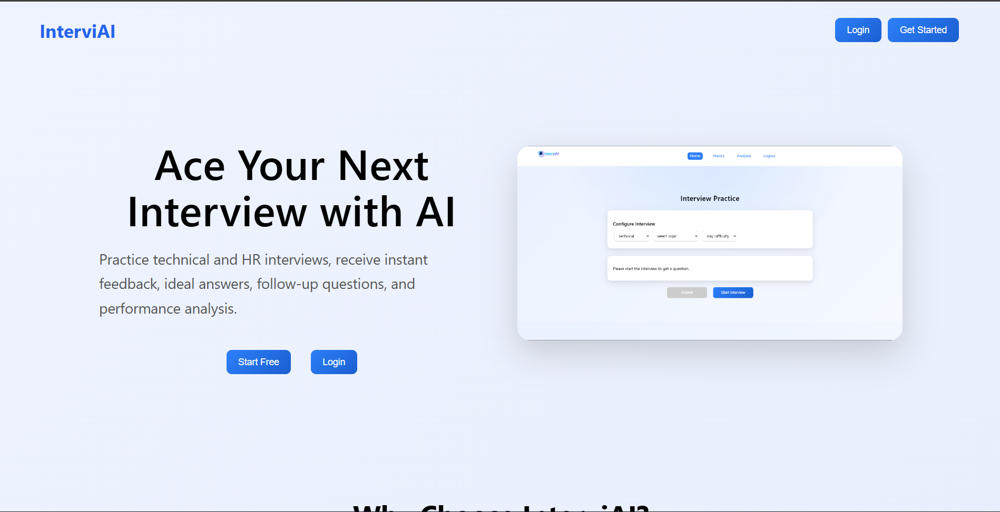
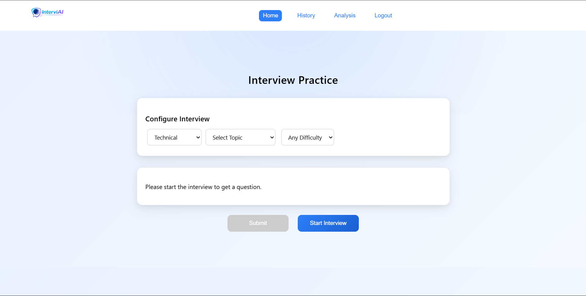
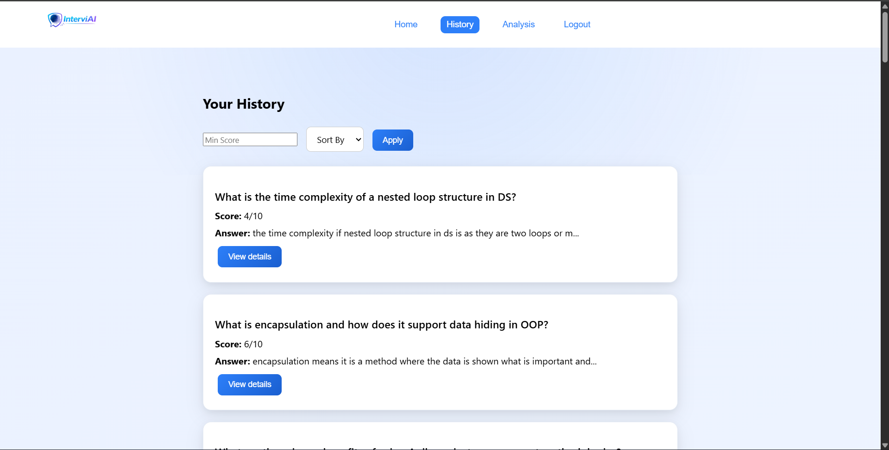
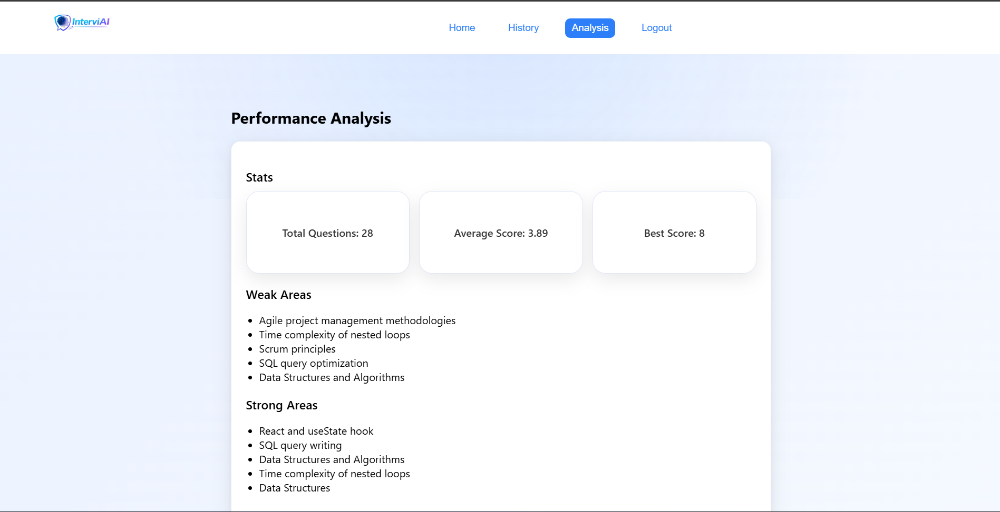

# InterviAI – AI-Powered Interview Preparation Platform

InterviAI is a full-stack AI-powered interview preparation platform that helps users practice technical and HR interviews through realistic interview sessions, adaptive follow-up questions, AI evaluation, and performance analytics.

## Features

### AI Interview Question Generation

* Generate Technical, HR, and Mixed interview questions.
* Topic and difficulty-based interview preparation.
* Realistic interview-style questioning.

### AI Answer Evaluation

* AI-powered scoring system.
* Detailed feedback for improvement.
* AI-generated ideal answers.

### Adaptive Follow-Up Questions

* Dynamic follow-up questions generated based on user responses.
* Simulates real interview conversations.

### Interview Sessions

* Start and end interview sessions.
* Track question count and follow-up count.
* Session-based interview history.

### Performance Analytics

* Total questions attempted.
* Average score tracking.
* Best score tracking.
* AI-generated strong and weak areas.

### Interview History

* Review previous interview sessions.
* View answers, feedback, scores, and ideal answers.
* Session filtering and sorting.

### Authentication

* JWT Authentication.
* Google OAuth Login.

---
## Live Demo
🔗 https://ai-interview-frontend-xrvs.onrender.com

## Tech Stack

### Frontend

* React.js
* JavaScript
* CSS
* Vite

### Backend

* FastAPI
* Python
* SQLAlchemy

### Database

* MySQL

### AI Integration

* Groq API (Llama Models)

### Deployment

* Render

---

## Screenshots

### Landing Page



### Home Page



### History Page



### Analysis Dashboard



---

## Installation

### Clone Repository

```bash
git clone <your-repository-url>
cd Interview_AI
```

### Backend Setup

```bash
cd backend

python -m venv venv

venv\Scripts\activate

pip install -r requirements.txt

uvicorn main:app --reload
```

### Frontend Setup

```bash
cd frontend

npm install

npm run dev
```

---

## Environment Variables

### Backend (.env)

```env
DATABASE_URL=your_database_url

SECRET_KEY=your_secret_key

GROQ_API_KEY=your_groq_api_key

GOOGLE_CLIENT_ID=your_google_client_id
```

### Frontend (.env)

```env
VITE_API_BASE_URL=your_backend_url
```

---

## Project Architecture

```text
React Frontend
      ↓
 FastAPI Backend
      ↓
     MySQL
      ↓
   Groq API
```

---

## Future Improvements

* Voice-based interviews
* Resume-based interview generation
* Company-specific interview preparation
* AI interviewer avatar
* Personalized learning roadmap
* Advanced analytics dashboard

---

## Resume Description

Built a full-stack AI-powered interview preparation platform using React, FastAPI, MySQL, and Groq API featuring adaptive interview sessions, AI answer evaluation, follow-up questioning, session tracking, analytics, JWT authentication, and Google OAuth login.

---

## Author

Bharath Kumar Reddy Anugu